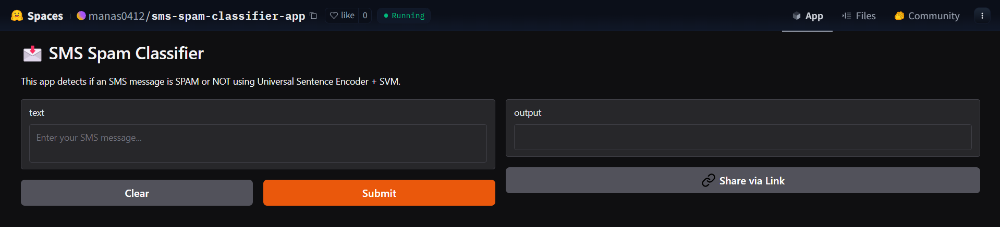

# SMS Spam Classifier

## Table of Contents

1. [Objective](#objective)
2. [Project Overview](#project-overview)
3. [Features](#features)
4. [Installation](#installation)
5. [Usage](#usage)
6. [Deployment](#deployment)
7. [Contributors](#contributors)

---

## Objective

Build an SMS spam classification pipeline that:

- Uses the Universal Sentence Encoder (USE) to embed text.
- Trains an SVM classifier to distinguish between **ham** (non-spam) and **spam** messages.
- Employs data augmentation (synonym replacement & typos) for robustness.
- Tunes model hyperparameters and decision threshold to maximize F1-score.

## Project Overview

1. **Data Preparation**

   - Load raw SMS data from CSV files.
   - Augment text via synonym replacement and typo introduction.
   - Split into training and validation sets.

2. **Embedding**

   - Use TensorFlow Hub’s USE (via `tensorflow-text`) to convert SMS text into fixed-length embeddings.

3. **Training**

   - Build an SVM pipeline with `StandardScaler`.
   - Perform **GridSearchCV** over `C`, `kernel`, and `gamma` parameters.
   - Select best model by **F1-score**.
   - Tune classification threshold on validation data.

4. **Evaluation**
   - Load the saved model and threshold.
   - Compute **Precision**, **Recall**, **F1-Score**, **Accuracy**, **Confusion Matrix** and **ROC-AUC** on held-out test data.
   - Visualize results (`confusion heatmap`, `ROC curve`).

## Features

- **Data Augmentation**:
  - Synonym replacement using `NLTK’s WordNet`.
  - Random typo injection to improve generalization.
- **Hyperparameter Tuning**:
  - Grid search over SVM parameters.
  - 5-fold cross-validation optimizing F1-score.
- **Threshold Optimization**:
  - Sweep thresholds [0.1–0.9] on validation set to maximize F1.
- **Comprehensive Evaluation**:
  - Classification report, Confusion Matrix heatmap, ROC curve with AUC.

## Installation

1. **Clone the repository**:
   ```bash
   git clone https://github.com/manask0412/sms-spam-detection.git
   cd sms-spam-classifier
   ```
2. **Create & activate a virtual environment (optional but recommended)**:
   ```bash
   python -m venv venv
   source venv/bin/activate    # macOS/Linux
   .\venv\Scripts\activate     # Windows
   ```
3. **Install dependencies**:
   ```bash
   pip install -r requirements.txt
   ```

## Usage

1. **Training the Model**:

   ```bash
   python scripts/train.py
   ```

   - Loads the training dataset from `data/train.csv`
   - Preprocesses and augments the text data with:
     - **Synonym replacement** (using `WordNet`).
     - **Typo Injection** for robustness.
   - Embeds messages using the `Universal Sentence Encoder (USE)`.
   - Builds an SVM classifier pipeline with `StandardScaler`.
   - **Tunes hyperparameters** using `GridSearchCV` over:
     - `C`, `kernel` and `gamma` values.
     - Optimized for best F1-score using **5-Fold** **Cross-Validation**.
   - **Optimizes the classification threshold** on validation data.
   - Saves the best-performing model and tuned threshold to:
     - `models/svm_spam_classifier.joblib`
   - This step is crucial to create a **Robust**, **Generalizable Spam Detection Model**.

2. **Evaluating the Model**:
   ```bash
   python scripts/evaluate.py
   ```
   - Loads the held-out test dataset from `data/evaluation.csv`
   - Loads the trained SVM model and the optimal classification threshold from `models/svm_spam_classifier.joblib`
   - Embeds test messages using the `Universal Sentence Encoder (USE)`
   - Generates predictions and evaluates performance using:
     - **Accuracy**, **Precision**, **Recall**, **F1-Score** and **AUC**.
   - Saves the following visual outputs to the `results/` directory:
     - `confusion_matrix.png` – Confusion matrix heatmap.
     - `roc_curve.png` – ROC curve with AUC.
   - These outputs help us assess the classifier’s performance and decision boundary.

## Deployment

The SMS Spam Classifier is also available as a live interactive demo on **Hugging Face Spaces**, powered by **Gradio**.

### How it works

Enter an SMS message into the input box. The model uses a pre-trained SVM pipeline with **Universal Sentence Encoder** embeddings to classify the message as either **Spam** or **Ham** (not spam).

### 🔗 Live Demo

[](https://huggingface.co/spaces/manas0412/sms-spam-classifier-app)

### 🖼️ Screenshot



## Contributors

| Name             | GitHub Profile                               | Role      |
| ---------------- | -------------------------------------------- | --------- |
| Manas Kumar Jena | [@manask0412](https://github.com/manask0412) | Developer |

---
